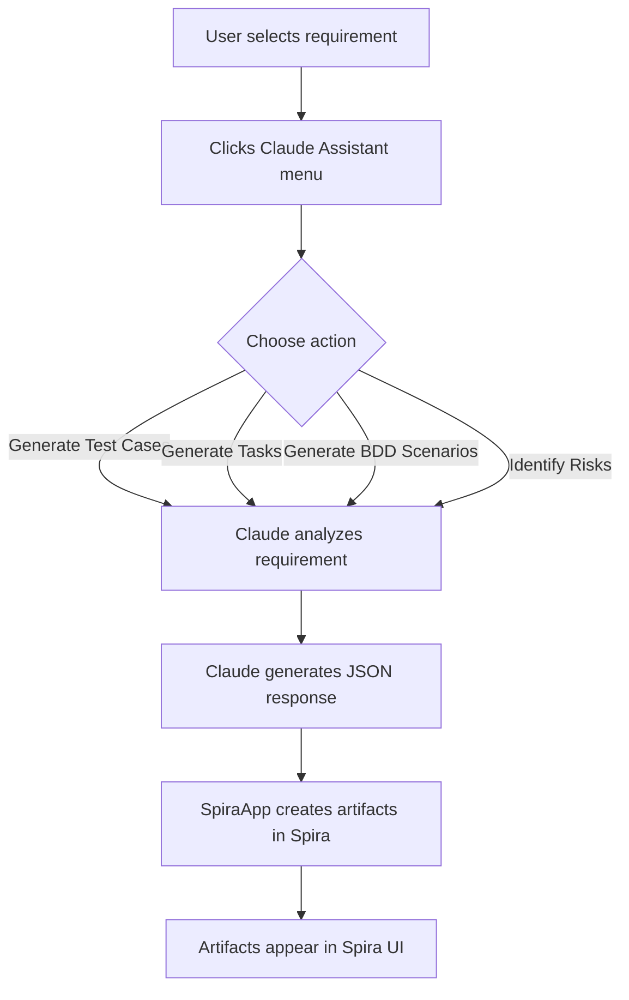
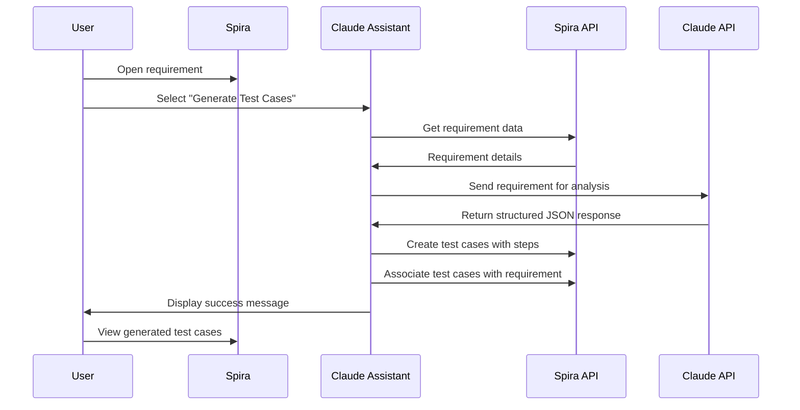

# Claude Assistant SpiraApp

This SpiraApp integrates Claude AI capabilities into Spira, allowing you to leverage generative AI to automatically create downstream artifacts from your requirements.

## Features

- **Test Case Generation**: Create test cases with detailed steps from requirements
- **Task Generation**: Generate development tasks based on requirement content
- **BDD Scenario Generation**: Create Gherkin-syntax BDD scenarios for requirements
- **Risk Identification**: Identify potential business and technical risks for requirements

## How It Works

The SpiraApp uses Claude AI to analyze your requirements and generate various artifacts. It integrates directly into Spira's UI, adding menu options to relevant pages.



## Setup

### System Administration

1. Install the SpiraApp in your Spira instance
2. Go to System Administration > SpiraApps
3. Configure the required system settings:
   - **Claude API Key**: Your API key from Anthropic (stored securely)
   - **Model Name**: The Claude model to use (default: claude-3-sonnet-20240229)

### Product Configuration

1. Enable the SpiraApp for your product in Product Administration > SpiraApps
2. Configure product-specific settings:
   - **Global Prompt**: Base system prompt for all generations
   - **Test Case Prompt**: Specific instructions for test case generation
   - **Task Prompt**: Specific instructions for task generation
   - **BDD Prompt**: Specific instructions for BDD scenario generation
   - **Risk Prompt**: Specific instructions for risk identification
   - **Temperature**: Controls creativity vs determinism (0.0-1.0)
   - **Use Artifact Descriptions**: Include full descriptions in prompts (not just names)

## Usage

### Requirement Details Page

The Claude Assistant appears in the toolbar on the requirement details page:

1. Navigate to a requirement
2. Click the "Claude Assistant" menu in the toolbar
3. Select the artifact type you want to generate:
   - **Generate Test Cases**: Creates test cases with steps based on the requirement
   - **Generate Tasks**: Creates development tasks for implementing the requirement
   - **Generate BDD Scenarios**: Creates BDD scenarios in Gherkin format
   - **Identify Risks**: Identifies business and technical risks related to the requirement



## Technical Details

### API Integration

The SpiraApp makes secure API calls to Claude, leveraging Spira's built-in templating for secure credential handling. The API interactions follow this pattern:

1. Spira credentials are used to retrieve the current artifact's details
2. A system prompt is constructed based on configured settings
3. Claude API is called with appropriate temperature and token settings
4. Claude's JSON response is parsed and converted to Spira artifacts
5. New artifacts are created via Spira's API and linked to the source requirement

### Permissions

The SpiraApp respects Spira's permission system:
- Users must have permission to view the source artifacts
- Users must have permission to create the target artifacts
- Users without appropriate permissions will see error messages

### Error Handling

The SpiraApp includes robust error handling:
- Validates all required settings before API calls
- Prevents multiple simultaneous operations
- Handles API errors gracefully with user-friendly messages
- Logs detailed diagnostic information to the console for troubleshooting

## Development

### Building the SpiraApp

To build the SpiraApp package:

1. Clone the repository
2. Ensure you have Node.js installed
3. Run the build script:
   ```bash
   # Using the included build.sh
   ./build.sh
   
   # Or directly with npm
   npm run build
   ```

### Architecture

The SpiraApp is organized into modular components:

- **manifest.yaml**: Defines the SpiraApp structure, menus, and settings
- **requirementDetails.js**: Main implementation for requirement page functionality
- **claudeAssistant.js**: Claude API integration functions
- **common.js**: Shared utility functions
- **constants.js**: Application constants and message strings

Each artifact generation function follows a common pattern:
1. Check permissions and validate settings
2. Retrieve the source artifact data
3. Construct the prompt based on settings
4. Send the request to Claude AI
5. Parse the response and create new artifacts
6. Link the new artifacts to the source
7. Display success message and refresh the UI

## Future Enhancements

The SpiraApp is structured for expansion with placeholder files for:
- Risk details page integration
- Test case details page integration

Future versions will add support for:
- Generating mitigations for risks
- Generating test steps for existing test cases
- Enhanced customization of generation parameters
- Support for more Claude AI models and capabilities

## Troubleshooting

If you encounter issues:

1. Check console logs for detailed error messages
2. Verify your Claude API key is correct and has sufficient permissions
3. Ensure your Spira user account has appropriate permissions
4. Check that the selected Claude model is available in your Anthropic account
5. For large requirements, try adjusting the temperature setting to improve results

## Support

For support or to report issues, please contact the development team through GitHub.
